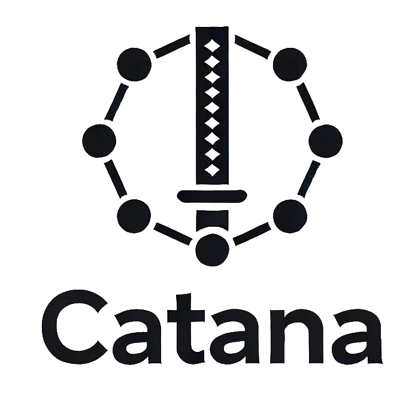

<div align="center">
  
</div>

Capture-Replay Testing for Proxy-based Upgradeable Smart Contracts

## Getting Started
1. Install the dependencies: with ```npm install```.
2. Add your Infura and Etherscan API keys in ```catana-config.js```.
3. Add your project configuration in ```catana-config.js```.
4. If needed, add the correct compiler version in ```hardhat-config.js```.

## Commands

| Command       | Description                        | Usage                    | Example                             |
|---------------|------------------------------------|--------------------------|-------------------------------------|
|`capture <nTx> [startBlock]`    | Extract a window of max nTx transactions executed on the Proxy, from an optional startBlock | `$ npm start buildWindow` | `$ npm start buildWindow 10000` |
| `replay <strategy>`    | Replay transactions on the local USC (single txHash, all) | `$ npm start replay <strategy>` | `$ npm start replay 0x078abc...` |
| `clean`    | Clean the testing environment | `$ npm start clean` | `$ npm start clean` |

## Project Structure

* ```contracts/```: source codes of the Proxy contract, and of the Local Logic contract under test (V2);
* ```contracts/deployed```: source codes of the Proxy contract, and of the old Logic contract deployed on Mainnet (V1);
* ```hardhat.config.js```: Hardhat configuration file; 
* ```catana-config.js```: Replay testing configuration file; 

## Configuration

The Catana configuration is specified in a [catana-config.js](https://github.com/MorenaBarboni/Catana/blob/main/src/catana-config.js) file.

| Field | Description | Default Value |
| ------ | ------ |  :----: |
| ```catanaDir```| name of the directory where the catana logs are saved | ```./catana``` |
| ```transactionsPath```| path to the file containing the transactions to be replayed | ```./catana/transactions/transactions.json``` |
| ```DeployedSourcesDir```| path to the folder where the sources of the deployed contracts will be stored | ```./contracts/deployed``` |
| ```UpgradedSourcesDir```| path to the folder where the sources of the upgraded contracts (SUT) are stored | ```./contracts``` |
| ```ProxyPath```| Local path to the source code of the Proxy contract | - |
 | ```UpgradedLogicPath```| Local path to the source code of the upgraded Logic contract under test | - | 
 | ```DeployedProxyAddr```| Address of the Proxy contract deployed on the Mainnet | - |  
 | ```DeployedLogicAddr```| Address of the Logic contract (V1) deployed on the Mainnet | - |
 | ```stateVarsBlacklist```| Blacklist for state variables to be ignored during Capture-Replay testing |  ```["__gap", "_gap"]```| 
| ```INFURA_KEY```| Infura api key | - |
| ```ETHERSCAN_KE```| Etherscan api key | - |

Here's a simple example of ```catana-config.js```.

```
module.exports = {
    catanaDir: "./catana",
    transactionsPath: "./catana/transactions/transactions.json",
    DeployedSourcesDir: "./contracts/deployed",
    UpgradedSourcesDir: "./contracts",
    ProxyPath: "./contracts/CErc20Delegator.sol",
    UpgradedLogicPath: "./contracts/CErc20Delegate.sol",
    DeployedProxyAddr: "0x5d3a536e4d6dbd6114cc1ead35777bab948e3643",
    DeployedLogicAddr: "0xa035b9e130F2B1AedC733eEFb1C67Ba4c503491F",
    stateVarsBlacklist: ["__gap", "_gap", "myVar"],
    INFURA_KEY: "your-infura-key",
    ETHERSCAN_KEY: "your-etherscan-key"
}
```